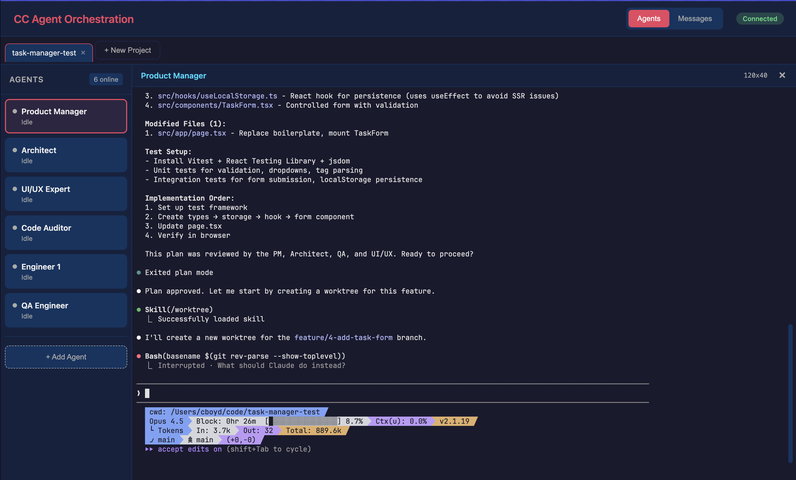
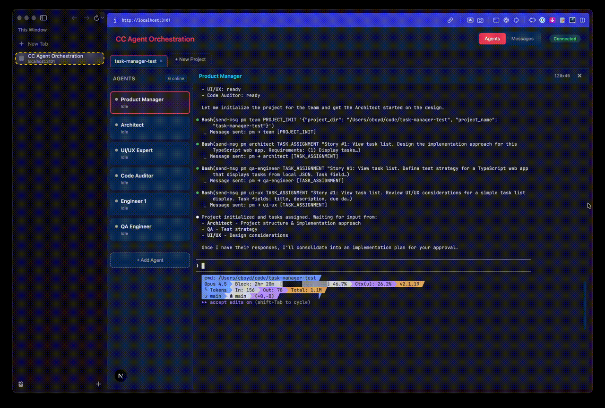

# CC Dev Team

A multi-agent orchestration system that enables teams of AI agents to collaborate on software development tasks. Built on top of [Claude Code](https://claude.ai/code), it allows a human developer to work with a **Product Manager agent** that coordinates specialized sub-agents (Architect, Engineer, QA, etc.) running in parallel Claude Code sessions.


<!-- SCREENSHOT: Dashboard overview showing agents panel and terminal -->


## Features

- **Multi-Agent Collaboration** - Specialized AI agents work together: PM, Architect, Engineer, QA, UI/UX Expert, and Code Auditor
- **Real-Time Dashboard** - Monitor all agents, view their terminals, and watch team communication in real-time
- **Headless Agent Mode** - Sub-agents run in headless mode, controllable from the web dashboard
- **Persistent Message History** - All inter-agent communication stored in SQLite for debugging and replay
- **Extensible Architecture** - Easy to add new agent roles and customize behavior
- **Claude Code Integration** - Each agent is a full Claude Code session with access to all its capabilities

<!-- SCREENSHOT: Agent terminals showing collaboration -->


## How It Works

```
┌─────────────────────────────────────────────────────────────────────────┐
│                            HUMAN DEVELOPER                              │
│                              (Dashboard)                                │
└─────────────────────────────────────────────────────────────────────────┘
                                    │
                                    ▼
                          ┌───────────────────┐
                          │  PRODUCT MANAGER  │
                          │   (Claude Code)   │
                          │                   │
                          │ • Human interface │
                          │ • Delegates work  │
                          │ • Approves plans  │
                          └───────────────────┘
                                    │
      ┌───────────┬─────────────────┼─────────────────┬───────────┐
      │           │                 │                 │           │
      ▼           ▼                 ▼                 ▼           ▼
┌───────────┐┌───────────┐┌─────────────────┐┌───────────┐┌───────────┐
│ ARCHITECT ││ ENGINEER  ││   QA ENGINEER   ││   UI/UX   ││   CODE    │
│           ││           ││                 ││  EXPERT   ││  AUDITOR  │
│  Design   ││ Implement ││ Test & Verify   ││  Design   ││  Review   │
│           ││           ││                 ││  Review   ││  Quality  │
└───────────┘└───────────┘└─────────────────┘└───────────┘└───────────┘
      │           │                 │                 │           │
      └───────────┴─────────────────┼─────────────────┴───────────┘
                                    │
                          ┌───────────────────┐
                          │   MESSAGE BROKER  │
                          │    (Socket.io)    │
                          └───────────────────┘
```

## Prerequisites

- **Node.js 18+**
- **[Bun](https://bun.sh)** - For the dashboard
- **[Claude Code CLI](https://claude.ai/code)** - Installed and authenticated
- **macOS** (Apple Silicon) - Other platforms may require PTY package changes

## Quick Start

Run this single command to install and start:

```bash
bunx @hoverlover/cc-dev-team
```

That's it! This will:
- Check prerequisites
- Install to `~/.cc-dev-team` (first run only)
- Check for updates (subsequent runs)
- Start the broker, dashboard, and all agents

Then open **http://localhost:3101** to access the dashboard.

## Manual Installation

If you prefer to clone the repository manually:

```bash
# Clone the repository
git clone https://github.com/hoverlover/cc-dev-team.git
cd cc-dev-team

# Run the install script
./scripts/install.sh

# Start the orchestrator
./start-orchestrator.sh
```

## Starting Components Individually

For development or debugging, you can start components separately:

```bash
# Terminal 1: Start the message broker
./scripts/start-broker.sh

# Terminal 2: Start the dashboard
./scripts/start-dashboard.sh

# Terminal 3: Start the PM (from your project directory)
cd /path/to/your/project
~/.cc-dev-team/scripts/start-pm.sh

# Terminal 4+: Start sub-agents
~/.cc-dev-team/scripts/start-agent.sh architect
~/.cc-dev-team/scripts/start-agent.sh engineer
```

## Usage

Once started, open the dashboard at **http://localhost:3101** and give the PM a task:

```
> "Let's add OAuth authentication with Google and GitHub"
```

The PM will coordinate with the team to plan, implement, and verify the feature.

### Direct Agent Interaction

While the PM handles coordination, you can talk directly to any agent by selecting their terminal in the dashboard and typing. This is useful for:

- **Deep technical discussions** with the Architect about design trade-offs
- **Debugging sessions** with the Engineer on specific implementation details
- **Clarifying test requirements** with QA
- **Design feedback** with the UI/UX Expert

Each agent is a full Claude Code session with complete context of the project and conversation history.

## Dashboard

<!-- SCREENSHOT: Dashboard showing messages view -->


The web dashboard provides:

- **Agents Panel** - See all agents with real-time status (Idle, Thinking, Working)
- **Terminal View** - Full interactive terminal for each agent
- **Messages View** - Team chat showing all inter-agent communication

## Agent Roles

| Agent | Role | Responsibilities |
|-------|------|------------------|
| **Product Manager** | Orchestrator | Human interface, task delegation, plan approval |
| **Architect** | Design Lead | System design, architecture decisions, specifications |
| **Engineer** | Implementation | Code writing, feature development |
| **QA Engineer** | Quality | Testing, verification, bug reporting |
| **Code Auditor** | Review | Security review, code quality, best practices |
| **UI/UX Expert** | Design | User experience, interface design, accessibility |

## Communication Protocol

Agents communicate through WebSocket messages via the broker:

- **Direct messages**: `agent → specific agent`
- **Broadcasts**: `agent → team` (all agents)
- **Message types**: `PROJECT_INIT`, `TASK_ASSIGNMENT`, `PROPOSAL`, `QUESTION`, `HANDOFF`, `RESPONSE`, etc.

All messages are persisted to SQLite for history and debugging.

## Typical Workflow

1. **Human** tells PM what to build
2. **PM** breaks down the task and assigns to team
3. **Architect** creates technical design
4. **PM** presents plan to human for approval
5. **Human** approves (or requests changes)
6. **Engineer** implements the feature
7. **QA** tests and verifies
8. **Code Auditor** reviews for quality/security
9. **PM** reports completion to human

## Project Structure

```
cc-dev-team/
├── agents/                 # Agent personas and configurations
│   ├── pm/                 # Product Manager
│   ├── architect/          # System Architect
│   ├── engineer/           # Software Engineer
│   ├── qa-engineer/        # QA Engineer
│   ├── code-auditor/       # Code Auditor
│   └── ui-ux/              # UI/UX Expert
├── broker/                 # Message broker (Socket.io server)
├── dashboard/              # Web dashboard (Next.js + TypeScript)
├── hooks/                  # Claude Code hooks for message notification
├── scripts/                # Startup and utility scripts
├── tools/                  # Agent tools (send-msg, get-roster, etc.)
├── data/                   # SQLite database for messages
└── logs/                   # Agent logs
```

## Configuration

### Environment Variables

| Variable | Default | Description |
|----------|---------|-------------|
| `BROKER_PORT` | 3100 | Message broker port |
| `BROKER_URL` | http://localhost:3100 | Broker URL for agents |
| `NEXT_PUBLIC_BROKER_URL` | http://localhost:3100 | Broker URL for dashboard |

## Agent Tools

These tools are available to Claude Code agents for inter-agent communication:

### send-msg

Send messages between agents:

```bash
send-msg <from> <to> <type> '<content>'

# Examples:
send-msg pm team PROJECT_INIT '{"description":"Add OAuth"}'
send-msg architect engineer TASK_ASSIGNMENT '{"task":"implement login"}'
```

### get-roster

Check which agents are online:

```bash
get-roster
```

## Troubleshooting

### Broker not running
```
⚠️ Broker not detected at localhost:3100
```
Start the broker first: `./scripts/start-broker.sh`

### Agent not receiving messages
1. Check broker is running
2. Verify agent shows as "online" in dashboard
3. Check `logs/` directory for agent-specific logs

### Dashboard not connecting
1. Ensure broker is running on port 3100
2. Check browser console for WebSocket errors
3. Verify `NEXT_PUBLIC_BROKER_URL` if using custom ports

## Platform Support

Currently tested on **macOS (Apple Silicon)**. The PTY wrapper uses platform-specific packages:

- macOS ARM64: `@lydell/node-pty-darwin-arm64`

For other platforms, update `package.json` with the appropriate `node-pty` variant and modify `tools/claude-wrapper.js` accordingly.

## Contributing

Contributions are welcome! Please feel free to submit issues and pull requests.

## License

This project is licensed under the GPL-3.0 License - see the [LICENSE](LICENSE) file for details.

## Acknowledgments

- Built on [Claude Code](https://claude.ai/code) by Anthropic
- Dashboard powered by [Next.js](https://nextjs.org/) and [xterm.js](https://xtermjs.org/)
